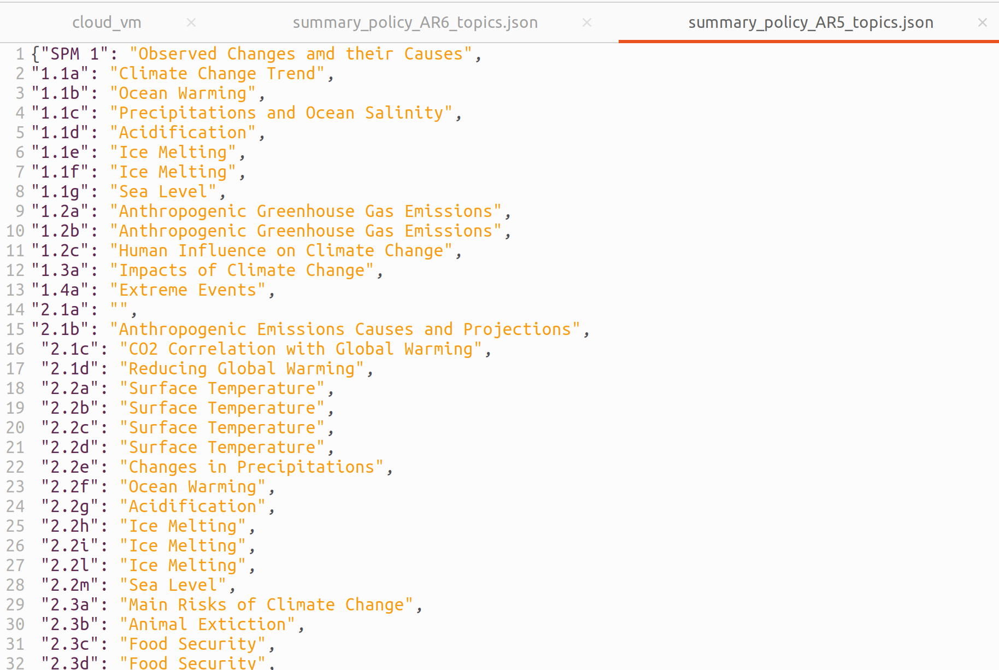
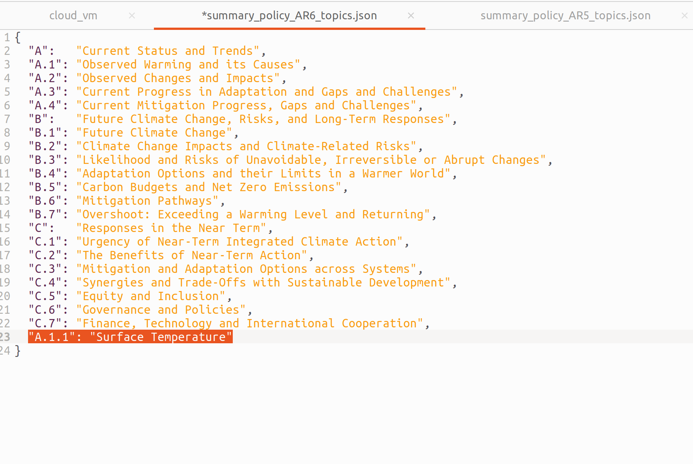
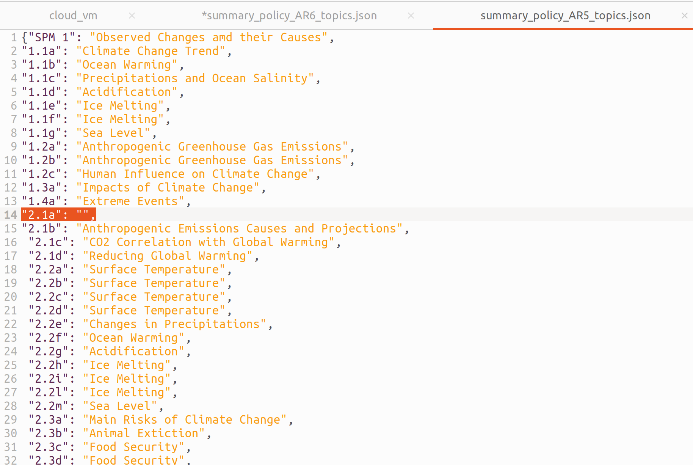
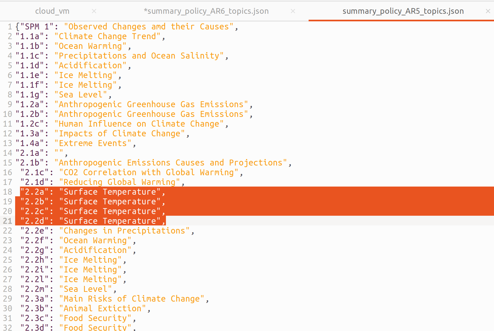

# Annotazione Manuale Dati (AR6)

I file rilevanti per AR5 sono gia' pronti (AR5.yaml, summary_policy_AR5_topics.json) e possono essere usati come riferimento per l'annotazione di AR6.
Per annotare i dati manualmente, iniziamo dal file AR6.yaml.


Dalla figura sopra vedete che AR6.yaml contiene un campo chiamato "summaries": quello e' il campo su cui ci concentriamo.
Avendo AR6.yaml aperto sui summaries, apriamo anche il file summary_policy_AR6_topics.json: li dentro andranno le annotazioni manuali per ogni summary.
Notate bene che ci sono gia' delle annotazioni li: quelle annotazioni si riferiscono ai macro-argomenti piuttosto che ai singoli riassunti e se volete potete guardarle per decidere meglio quale argomento assegnare ad un riassunto se siete in dubbio.

Per ogni summary in summaries (i vari summary sono ognuno associato ad un identifier alfanumerico, e.g. "A.1.1"), date una letture non necessariamente integrale ma comunque abbastanza attenta da capire l'argomento del riassunto. Per esempio, guardiamo il titolo che ho associato al riassunto 1.1a di AR5 nella figura sottostante. 



Potete vedere che solitamente dalle prime parole del riassunto si puo' gia' evincere l'argomento generale, ma comunque e' buona norma scorrere anche verso la fine per vedere se c'e' uno shift importante di argomento nel corso del riassunto. Una volta deciso l'argomento piu' calzante per il riassunto, aggiungere il nome dell'argomento nel file summary_policy_AR6_topics.json.
La prossima figura mostra un esempio di un titolo aggiunto per AR6, come vedete aggiungiamo il titolo del riassunto come un semplice key-value dove la chiave e' l'identifier alfa-numerico del riassunto ed il valore associato e' il titolo o argomento del riassunto, cosi come deciso da voi.



## Casi Specifici

Principalmente il framework sopra dovrebbe funzionare nella magior parte dei casi, ma ci sono due casi specifici a cui fare attenzione.

1) Un riassunto non sembra corretto in generale (ha un argomento troppo ampio oppure il riassunto stesso e' troppo breve o troppo lungo, usate la vostra discrezione per giudicare questa cosa).

2) Due riassunti parlano della stessa cosa.


Nel caso numero 1, aggiungete un titolo vuoto in summary_policy_AR6_topics.json cosi come illustrato nella figura di sotto. Questi titoli vuoti sono poi carpiti dal postprocessing script ed i relativi riassunti verranno eliminati, quindi usate con discrezione questo tipo di annotazione tenendo presente che rappresenta la vostra optnione che quel riassunto e' meglio eliminarlo dal dataset.



Nel caso numero 2, date semplicemente lo stesso titolo che avete dato al previo riassunto al riassunto corrente. Ovvero, fate attenzione che riassunti che hanno lo stesso argomento abbiano esattamente lo stesso titolo annotato in summary_policy_AR6_topics.json. Nell'esempio della figura sottostante, per esempio, riassunti 2.2a, 2.2b, 2.2c e 2.2d parlavano tutti del riscaldamento della superficie terrestre e, come potete vedere, lo stesso titolo e' stato usato per tutti loro.




## Collaborare su GitHub

Dato che andremo a modificare lo stesso documento, il modo migliore di agire suppongo sia quello di lavorare sullo stesso file in branch differenti e poi fare un'unico commit alla fine che includa le annotazioni di tutti. Per creare la vostra branch, nella vostra copia locale di questa repo mandate questi codici:

```
git checkout GhinzoSan
git checkout -b <nuova_branch>
```

Sostituendo <nuova_branch> con quel che cazzo vi pare.

